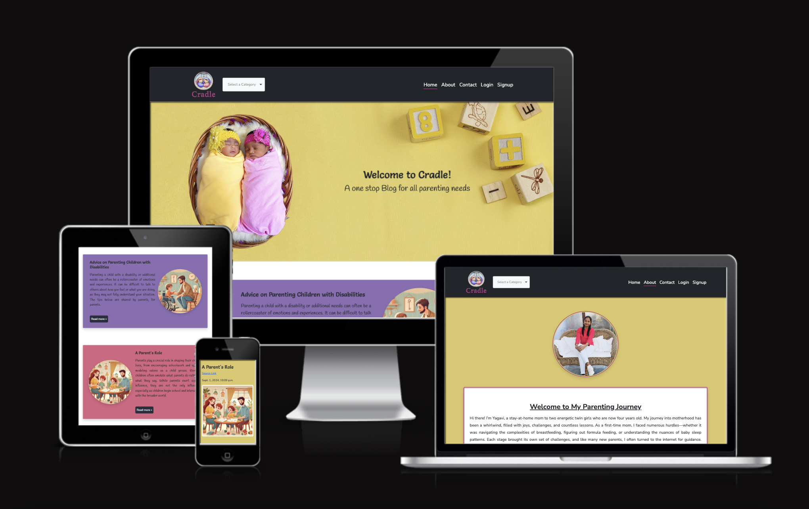
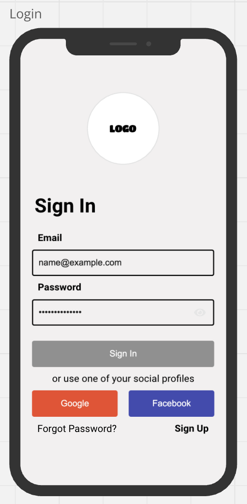
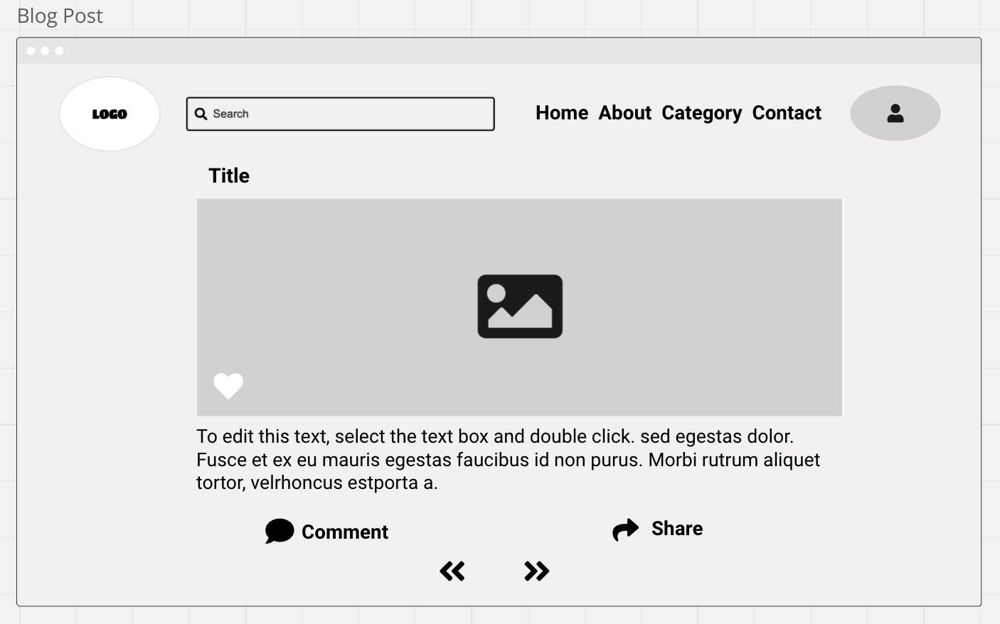
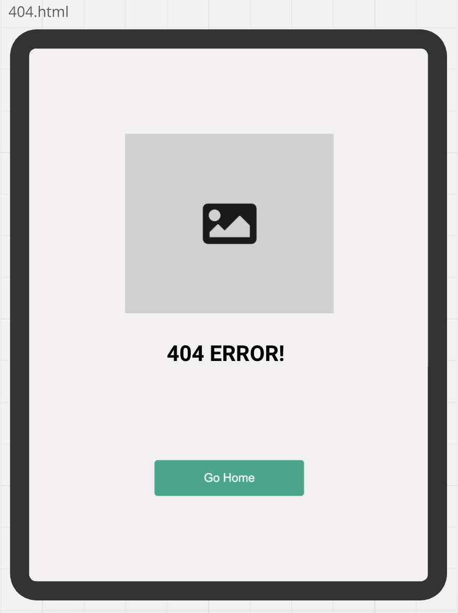
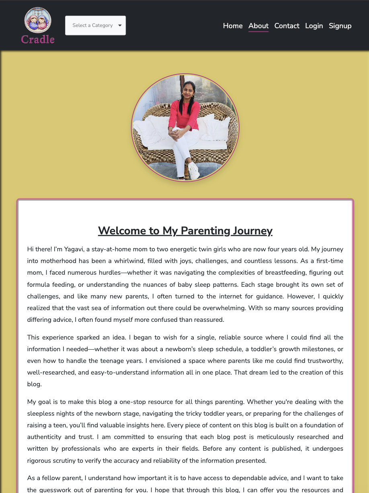
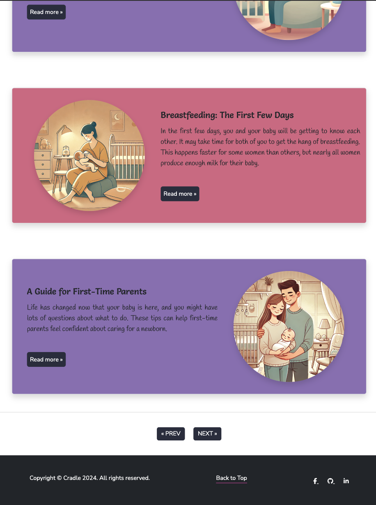
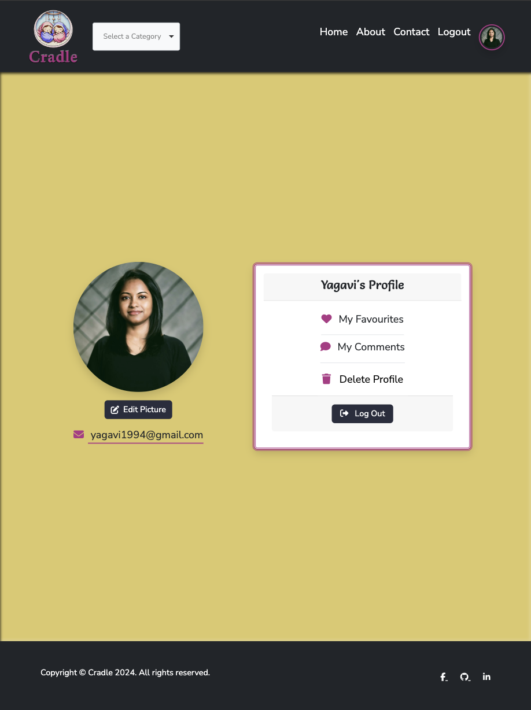
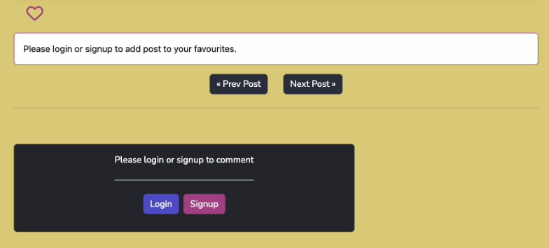
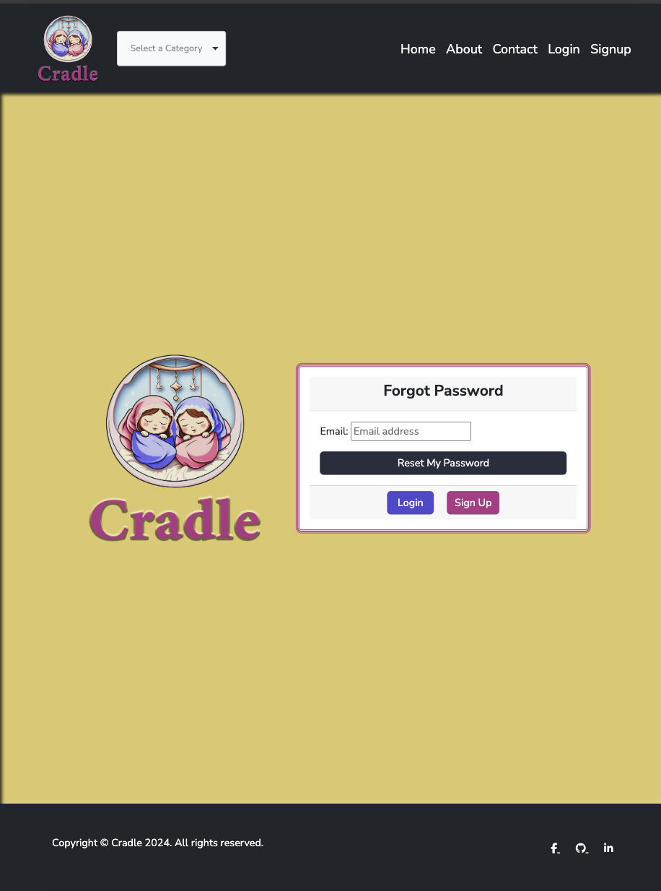

# Cradle Blog

Link to the website: [Cradle Blog](https://cradle-blog-e042a0fbdf0d.herokuapp.com/)

# Project Overview

"Cradle Blog" aims at providing trustworthy, well-researched, and easy-to-understand information for parents, covering topics from newborn care to toddler years. As a first-time mom, I faced numerous hurdles—whether it was navigating the complexities of breastfeeding, figuring out formula feeding, or understanding the nuances of baby sleep patterns. Each stage brought its own set of challenges, and like many new parents, I often turned to the internet for guidance. However, I quickly realized that the vast sea of information out there could be overwhelming. With so many sources providing differing advice, I often found myself more confused than reassured.

This experience sparked an idea. I began to wish for a single, reliable source where I could find all the information I needed—whether it was about a newborn’s sleep schedule, a toddler’s growth milestones, or even how to handle the teenage years. I envisioned a space where parents like me could find trustworthy, well-researched, and easy-to-understand information all in one place. That dream led to the creation of this blog.

# Table of Content 

- [Project Overview](#project-overview)
- [Project objectives](#project-objectives)
   - [User Goals](#user-goals)
   - [Site Owner Goals](#site-owner-goals) 
- [User Experience](#user-experience)
   - [Target user](#target-user)  
   - [First Time Visitor Goals](#first-time-visitor-goals)
   - [Registered User Goals](#registered-user-goals)
   - [Admin Goals](#admin-goals)
   - [Future Goals](#future-goals)     
- [Design](#design)  
   - [Design choices](#design-choicesr)  
   - [Color Scheme](#color-scheme)
   - [Typography](#typography)  
   - [Imagery](#imagery)
   - [Logo](#logo)
- [Agile Methodology](#agile-methodology)
- [Database Scheme & User Journey](#database-scheme-&-user-journey)
   - [User Journey](#user-journey) 
   - [Database Scheme](#database-scheme) 
- [Wireframes](#wireframes)
- [Features](#features)
   - [Register page](#register-page)
   - [Log in page](#log-in-page)
   - [My projects](#my-projects)
   - [Home page](#home-page)
   - [Search](#search)
   - [Card](#card)
   - [Add Project Form](#add-project-form)
   - [Edit Project Form](#edit-project-form)
   - [Project page](#project-page)
   - [Comment](#cooment)
   - [Categories (admin only)](#categories)
   - [About page](#about-page)
   - [Log out](#log-out)
   - [404 and 505 error page](#404-and-505-error-page)
   - [Logo and Navigations Bar](#logo-and-navigations-bar)
- [Technologies Used](#technologies-used)
   - [Languages Used](#languages-used)
   - [Frameworks, libraries and programs used](#frameworks,-libraries-and-programs-used)
- [Testing](#testing)
- [Deployment & local development](#deployment-&-local-development)
   - [Deployment](#deployment)
   - [Local Development](#local-development)
      - [How to Fork](#how-to-fork)
      - [How to Clone](#how-to-clone)
- [Credits](#credits)
- [Aknowledgement](#aknowledgement)

# Project objectives

## User Goals

* Find reliable, well-researched, and easy-to-understand parenting information.
* Connect with other parents who are experiencing similar challenges.
* Gain guidance on various stages of child development, from newborns to toddlers.
* Read practical tips and advice on topics like feeding, sleep, and behavior management.
* Access expert insights on parenting challenges and solutions. 

---

## Site Owner Goals

* Build a trusted community of parents seeking reliable information and support.
* Offer a platform for parents to share their experiences and knowledge with others.
* Encourage users to regularly engage with content through comments and saving their favorite posts in their profile.
* Provide a seamless and user-friendly experience across all devices, making it easy to find and navigate content.
* Encourage visitors to register and subscribe for additional features (future premium membership options).

---

# User Experience

## User Stories

### Target user

* People who wants to prepare themselve before planning for a child
* People who are pregnant and going to have a baby soon
* People who are parents of children from newborn to toddlers

---

### First Time Visitor Goals

#### User Story 1: 
**As a Visitor**, I want to view the homepage so that I can see the latest blog posts.

- The homepage should display a list of the latest blog posts.
- Each blog post should show the title, a short excerpt, the author’s name, and the published date.
- Posts should be ordered by the published date, with the most recent posts appearing first.
- There should be a link to view the full post.
- The homepage should be accessible via the site’s main navigation.

---

#### User Story 2: 
**As a Visitor**, I want to read a full blog post so that I can engage with the content.

- Each blog post should have its own dedicated page.
- The post page should display the title, full content, source of the content and published date.
- There should be easy navigation to the previous and next posts.
- The page should include sharing options for social media.
- Comments should be displayed below the content.

---

#### User Story 3: 
**As a visitor**, I want to be able to navigate between posts using "next" and "previous" buttons so that I can explore more content.

- "Next" and "Previous" buttons should be present at the bottom of each blog post.
- Clicking "Next" should take the visitor to the next chronological blog post.
- Clicking "Previous" should take the visitor to the previous chronological blog post.
- The "Next" button should be disabled or hidden if there is no next post, and the same for "Previous."

---

#### User Story 4: 
**As a Visitor**, I want to filter blog posts by category so that I can browse specific topics.

- There should be a link to categories in main navigation bar which when clicked displays list of categories available.
- Clicking on a category should take the user to a page displaying all posts within that category.
- Posts within the category should be ordered by published date.
- Each post should show the title, a short excerpt, source of the content and the published date.

---

#### User Story 5:  
**As a visitor**, I want a navigation bar in the header so that I can easily access important pages like Home, About, Contact, Login, Register, Logout, Profile, and Categories.

- The navigation bar should be present at the top (header) of every page.
- The navigation bar should include the following links:
   - Home
   - About
   - Contact
   - Login (only if the user is not logged in)
   - Register (only if the user is not logged in)
   - Logout (only if the user is logged in)
   - Profile (only if the user is logged in)
   - Categories (dropdown with a list of blog categories)
- Each link should redirect the user to the respective page when clicked.
- The "Categories" link should have a dropdown or list that allows users to browse blog posts by different categories.
- The navigation bar should highlight the current active page to indicate where the user is browsing.

---

#### User Story 6:  
**As a visitor**, I want to see the blog's logo in the header so that I can easily recognize the brand.

- The blog's logo should be prominently displayed in the header of all pages.
- The logo should be clearly visible on both desktop and mobile devices.
- The logo should scale appropriately based on screen size without losing quality.
- The logo should be clickable, so that it redirects the user to the homepage for easier navigation.

---

#### User Story 7:  
**As a visitor**, I want the footer to include copyright information, a "Back to Top" button, and social media links so that I can access important details and navigate easily from any point on the page.

- The footer should display copyright information, including the blog's name and the current year (e.g., "© 2024 BlogName. All rights reserved").
- A “Back to Top” button should be present in the footer, allowing users to quickly return to the top of the page when clicked.
- Social media icons (e.g., Facebook, Twitter, Instagram, etc.) should be clearly visible in the footer and should open the respective platform's page in a new tab when clicked.
- The footer should be consistent and visible across all pages of the blog.
- The "Back to Top" button should provide smooth scrolling functionality when clicked.
- The social media links should be functional and lead to the correct social media profiles/pages.

---

#### User Story 8:  
**As a visitor**, I want to access the "About" page so that I can learn more about the blog and its purpose.

- There should be an “About” link or button available in the site's main navigation or footer.
- The "About" page should provide information about the blog’s mission, goals, and history.
- The page should be well-organized and easy to read, possibly including images or media to support the text.
- There should be a clear heading that indicates this is the "About" page.

---

#### User Story 9:  
**As a visitor**, I want to access the "Contact" page so that I can easily reach out to the blog administrators for inquiries or support.

- There should be a “Contact” link or button available in the site's main navigation or footer.
- The "Contact" page should include a contact form where users can submit their inquiries.
- The contact form should have fields for the user’s name, email address, and message.
- A confirmation message should appear after the form is successfully submitted.

---

#### User Story 10:  
**As a visitor**, I want to navigate between multiple pages of blog posts when there are more than 5 posts per page so that I can easily browse through the content.

- Pagination should be implemented when there are more than 5 blog posts to display on a single page.
- The pagination control should appear at the bottom of the page after the blog posts.
- There should be “Next” and “Previous” buttons to allow users to move forward or backward between pages.
- The number of posts displayed per page should remain consistent (5 posts per page) across all pages.
- Pagination should not negatively impact page load times or user experience.

---

#### User Story 11:  
**As a visitor**, I want the blog to be responsive across all devices so that I can have a seamless experience whether I am browsing on a desktop, tablet, or mobile device.

- The blog's layout should automatically adjust to fit different screen sizes, including desktop, tablet, and mobile.
- Text, images, and interactive elements (buttons, forms, etc.) should be clearly visible and usable on all devices without the need for zooming or excessive scrolling.
- Navigation elements such as the header, footer, and sidebar (if applicable) should adapt to smaller screen sizes, potentially using collapsible menus or dropdowns for easier access.
- The responsiveness should cover all major pages (e.g., Home, About, Contact, Posts, etc.).
- The blog should be tested across multiple devices and browsers to ensure consistency in user experience.
- Interactive elements (e.g., buttons, forms, links) should be easily tappable and clickable on touchscreens.
- Images and media should scale properly to maintain high quality without slowing down page load times on smaller devices.

---

### User Story 12: 
**As a visitor**, I want the blog pages to include smooth animations and vibrant colors so that my experience is visually engaging and enjoyable.

- Subtle animations (e.g., hover effects, transitions, button clicks) should be applied to interactive elements (e.g., buttons, links, images) to enhance user experience without distracting from content.
- Vibrant and visually appealing color schemes should be applied consistently across the blog, balancing aesthetics with readability.
- The animations should be smooth, lightweight, and not affect page load times or performance.
- Important elements like buttons, headers, and call-to-action areas should stand out with accent colors to guide user focus.
- The color scheme and animations should maintain consistency across all devices, including mobile and desktop, and adapt to the blog's responsiveness.
- Animations should be used sparingly to avoid overwhelming the user and should enhance, rather than disrupt, the reading and navigation experience.

---

#### User Story 13: 
**As a visitor**, I want to be informed that I need to login or signup before accessing certain features of the blog.

- When attempting to use restricted features (e.g., commenting, favoriting), the system should notify the user to login or signup.
- The user should be prevented from accessing these features until they are registered with the site.

---

#### User Story 14:  
**As a visitor**, I want to be able to signup for an account so that I can comment on and favourite blog posts.

- A “Signup” button should be clearly visible on the homepage or login page.
- The signup form should include fields for email, username, and password.
- Validation should occur to ensure that the email and username are unique and properly formatted.
- A list of password criteria should be mentioned, and the user should be alerted if those aren't met.
- A success message should be displayed after successful registration, prompting the user to log in.

---

#### User Story 15:  
**As a visitor**, I want to log in with my credentials so that I can access my account and personalize my experience.

- There should be a “Log In” button on the homepage or in the navigation bar.
- The login form should include fields for email/username and password.
- After successfully logging in, the user should be redirected to their profile or the homepage.
- An error message should be displayed if the login credentials are incorrect.

---

#### User Story 16:  
**As a visitor**, I want to log out from my account so that I can secure my session after use.

- A “Log Out” button should be present in the user’s profile or nav bar.
- Clicking the "Log Out" button should log the user out and redirect them to the homepage.
- A confirmation message should appear to inform the user they have logged out.
- After logging out, the user should no longer have access to account-specific features.

---

#### User Story 17:  
**As a visitor**, I want the blog pages to include smooth animations and vibrant colors so that my experience is visually engaging and enjoyable.

- Subtle animations (e.g., hover effects, transitions, button clicks) should be applied to interactive elements (e.g., buttons, links, images) to enhance user experience without distracting from content.
- Vibrant and visually appealing color schemes should be applied consistently across the blog, balancing aesthetics with readability.
- The animations should be smooth, lightweight, and not affect page load times or performance.
- Important elements like buttons, headers, and call-to-action areas should stand out with accent colors to guide user focus.
- The color scheme and animations should maintain consistency across all devices, including mobile and desktop, and adapt to the blog's responsiveness.
- Animations should be used sparingly to avoid overwhelming the user and should enhance, rather than disrupt, the reading and navigation experience.

---

### Registered User Goals

#### User Story 18:  
**As a newly registered user**, I want to receive an email verification link so that I can confirm my email address.

- Upon successful registration, the system should send a verification email with a unique link to the user’s provided email and display a message saying a verification link has been sent to your mail.
- The verification email should contain the link and clear instructions for verifying the account.
- Clicking the verification link should confirm the user's account, display a success message, and redirect to the login page.

---

#### User Story 19:  
**As a registered user**, I want to request a password reset link if I forget my password so that I can regain access to my account.

- There should be a “Forgot Password” link on the login page.
- Clicking the link should open a form where the user can enter their email.
- After submitting the form, the system should send a password reset link to the provided email.
- A success message should be displayed, informing the user that the reset email has been sent.

---

#### User Story 20:  
**As a registered user**, I want to be able to reset my password to a new one and log in after the process is complete.

- Clicking the reset link in mail should direct the user to a secure page where they can set a new password.
- The password reset form should include fields for entering and confirming the new password.
- The new password should be validated to meet security requirements (e.g., minimum length, complexity).
- Upon successful reset, the user should be able to log in with the new password.
- A confirmation message should inform the user that their password has been updated.

---

#### User Story 21: 
**As a registered user**, I want to leave comments on blog posts so that I can engage in discussions.

- The comment section should be available at the bottom of each blog post.
- Only registered users should be able to submit comments; visitors should see a prompt to log in or register.
- Users should be able to edit their comments by clicking the edit button below it after being posted.
- Users should be able to delete their comments by clicking the delete button below it after being posted.
- Comments should display the user’s name, avatar and the time it was posted.
- Comments should be listed in chronological order or with the newest comments first.

---

#### User Story 22: 
**As a registered user**, I want to add a blog post to my favourites by liking it so that I can easily access it later.

- Each blog post should have a “Like” or “Favourite” button clearly visible near the title or at the end of the post.
- When the user clicks the “Like” or “Favourite” button, the post should be added to their favourites list.
- The button should visually change (e.g., highlighted, filled heart/star icon) to indicate that the post has been favourited.
- A success message (e.g., “Added to your favourites”) should briefly appear after the post is liked.
- If the user clicks the button again, the post should be removed from their favourites, with a corresponding visual change and message (e.g., “Removed from your favourites”).
- The post should immediately appear in or be removed from the “Favourite Posts” section of the user's profile.
- A user should not be able to like or favourite a post more than once.
- The favourites list should be persistent, so it remains intact even if the user logs out and logs back in.

---

#### User Story 23: 
**As a registered user**, I want to view my profile page so that I can see my personal information.

- The profile page should be accessible via a link in the site’s navigation menu.
- The profile page should display the user’s avatar, full name, and email address.
- The email address should be visible.
- The profile page should have a consistent design with the rest of the site.
- The profile page should have links to view my favourite posts and my history of comments in the blog.
- The profile page should have link to delete my account.

---

#### User Story 24: 
**As a registered user**, I want to edit my profile picture so that I can change it whenever I wish.

- There should be an “Edit Picture” button or link available on the user's profile page.
- The "Edit Picture" page should allow the user to:
- Upload a new profile picture from their system.
   - Choose an avatar from a set of pre-defined options.
   - The user should have the option to delete their current profile picture, and after deletion, the profile picture should be replaced with the default avatar.
- Changes to the profile picture should only be saved when the user confirms the update by clicking a "Save" or "Update" button.
- After successfully updating the profile picture, a confirmation message should be displayed to the user.

---

#### User Story 25: 
**As a registered user**, I want to view a list of my favourite posts in my profile so that I can easily access content I have liked or saved.

- The profile page should include a link for “Favourite Posts.”
- The “Favourite Posts” section should display a list of posts the user has marked as favourite.
- Each post should display the title, a short excerpt, and the published date, with a link to view the full post.
- Posts should be listed in the order they were favourited, with the most recent ones first.

---

#### User Story 26: 
**As a registered user**, I want to view a history of my comments so that I can track my participation in discussions.

- The profile page should include a link for “My Comments.”
- The “My Comments” section should display a list of all comments the user has made.
- Each comment should show the content of the comment, the date it was posted, and the title of the blog post it was made on.
- Comments should be listed in reverse chronological order, with the most recent comments appearing first.
- Each comment should have a link to the original post where the comment was made, when clicked it should take the user to that particular comment highlighting it.

---

#### User Story 27: 
**As a registered user**, I want to delete my account so that I can remove all my data from the site.

- There should be a “Delete Account” option available in the profile settings.
- The user should be prompted to confirm the deletion with a warning that this action is irreversible.
- Upon confirmation, the user’s profile, comments, favourite posts, and any other personal data should be permanently deleted from the system.
- The user should be automatically logged out and redirected to the homepage after the account is deleted.

---

### Admin Goals 

#### User Story 28: 
**As an admin**, I want to manage blog posts so that I can control the content that is published.

- The admin should have access to a content management dashboard.
- The dashboard should allow the admin to create, edit, publish, and delete blog posts.
- The admin should be able to set or change the post’s status (draft, published, etc.).
- The admin should be able to add categories to each post.
- The admin should have the ability to manage comments (approve and delete).
- The admin should have the ability to view the name, email and message shared by the users through contact page.
- The admin should be able to view the email and username of a user and also delete the user accounts.

---

### Future Goals

- **Social Login Integration**: In the future, plan to implement Google and Facebook login options, allowing users to sign up and log in with their existing social media credentials, making the process quicker and more convenient.
  
- **Content Sharing Features**: Aim to add social sharing functionality, enabling parents to easily share blog posts, tips, and resources with their friends and family on various platforms like Facebook, Twitter, and WhatsApp.
  
- **Community Forum**: A future goal is to introduce a community forum where parents can interact, ask questions, and share their experiences with one another, creating a supportive space for learning and exchange.

- **Newsletter Subscription**: Plan to implement a newsletter subscription option, allowing users to receive curated content, parenting tips, and updates about new blog posts directly in their inbox.

- **Mobile App Development**: As the blog continues to grow, would like to create a mobile app for iOS and Android, giving parents access to the platform on the go with a more streamlined and optimized experience.

- **Premium Membership**: In the long-term, envision introducing premium membership options that would offer exclusive content, personalized advice, and special resources for subscribers.

- **Advanced Search and Filtering**: Another future enhancement will be improving the search and filtering capabilities of the blog, allowing users to easily find content tailored to their child’s age, stage, or specific challenges.

These goals aim to continually improve the user experience, build a stronger community, and provide parents with more value as they navigate the challenges of raising children.

---

# Design

## Design Choices

The design of Cradle Blog was crafted to be vibrant and playful, reflecting the theme of parenting and children. Since the blog caters to parents, many of whom are often overwhelmed with the responsibilities of raising a child, the design aims to inject a sense of fun and energy into their browsing experience. The goal was to create a space that feels lighthearted and colorful, offering parents a refreshing and engaging atmosphere.

## Color Scheme

The color palette for Cradle Blog was inspired by my twin girls' favorite colors—pink and purple. These personal elements were integrated into the blog to honor the role my daughters played in inspiring its creation. The main colors used are **pink**, **purple**, **yellow**, and **dark grey**:
- **Pink and purple** are the core colors throughout the blog, representing joy and connection.
- **Yellow** serves as the background for the pages, inspired by the bright banner image that features yellow. It brings a cheerful and lively tone to the website.
- **Dark grey** was chosen for the header and footer to provide a strong contrast with the lighter, more playful colors, ensuring readability and structure.
- **Dark pink** is used for accents such as underlines and borders, offering a cohesive and stylish contrast against the rest of the color scheme.

## Typography

The blog utilizes a mix of fonts from Google Fonts to enhance readability and emphasize key areas of the website. The selected fonts bring a balance of fun and clarity to the blog's aesthetic:
- **Salsa** is used for headings, giving a playful and distinct appearance to titles and headers.
- **Handlee** is applied to blog excerpts, adding a personal and handwritten feel that complements the blog’s warm tone.
- **Nunito Sans** is used for the rest of the content, including buttons, links, and forms, offering a clean and modern look that ensures legibility across all devices.

### Salsa

### Handlee

### Nunito

## Imagery

The imagery for Cradle Blog is designed to evoke warmth and personalization. The home page banner features a background image sourced from Freepik, with a personal touch—a picture of my twin girls placed on top of the background. Their presence on the site reminds me of the inspiration behind this blog. Other images used in the blog posts and avatars were generated using ChatGPT, providing a cohesive visual experience throughout the site.

## Logo

The logo was designed with my twin daughters in mind. Since their picture is featured in the banner, I wanted to continue that theme with the logo. It features two baby girls sleeping inside a cradle, symbolizing the core inspiration for the blog. The logo is not only a representation of Cradle Blog’s mission but also a personal homage to the journey of parenthood that led to its creation.

# Agile Methodology

Agile methodology is a flexible and iterative approach to software development that emphasizes collaboration, adaptability, and customer feedback. It allows teams to respond to changing requirements and deliver valuable features incrementally. In this project, we follow Agile principles to enhance productivity and ensure successful project delivery.

- **User Stories and Github Issues**: I utilized Github issues to create detailed user stories for my project. Each user story included essential components such as story points and acceptance criteria.These user stories were tracked either on the Kanban board or within the issues themselves.
- **Kanban Board for Prioritization**: The Github Kanban board played a crucial role in managing my project. User stories were assigned to specific issues, allowing me to define clear goals and priorities.

#### Project Sections: My project was organized into the following sections:

- To-do: User stories awaiting implementation.
- In-progress: Ongoing work.
- Done: Completed tasks.

To review the Kanban board for the project, please click [HERE](https://github.com/users/Yagavi1994/projects/3)

# Database Scheme & User Journey

## User Journey

## Database Scheme 

- Post has many Comments and Favourites, is linked to one Category, and is authored by one User.
- Category can have many Posts.
- Comment is linked to one Post and one User.
- Profile is linked to one User.
- Favourite links a User to a Post.

This entity-relationship diagram shows a well-structured design for a blog platform, allowing for efficient management of posts, comments, user profiles, and favorites, while ensuring smooth interaction between these entities.

# Wireframes

Register

 

### Mobile

### Tablet

### Laptop

Log In 

 

### Mobile

### Tablet

### Laptop

Home

 

### Mobile

### Tablet

### Laptop

Blog Post

 

### Mobile

### Tablet

### Laptop

Search Page/ Category Page

 

### Mobile

### Tablet

### Laptop

Profile Page

 

### Mobile

### Tablet

### Laptop

Favourites

 

### Mobile

### Tablet

### Laptop

Comments

 

### Mobile

### Tablet

### Laptop

400 Error

 

### Mobile

### Tablet

### Laptop

Log Out

 

### Mobile

### Tablet

### Laptop

# Features

Here is the detailed content for the features you requested, with relevant **User Stories** quoted under each feature, formatted for a `README.md` file:

---

## Features

### Home Page
The homepage has a banner on top with a welcome message and displays the latest blog posts in a clean and user-friendly format. Each post shows the title, a short excerpt, the author's name and the published date. Posts are ordered by the most recent first, providing users with fresh content at the top.

- **User Story 1**: The homepage should display a list of the latest blog posts with links to view the full content.

---

### About Page
The "About" page has a picture of the site owner and introduces the purpose and mission of the blog. It provides information on what the blog aims to achieve and the values behind it. This page is accessible from the main navigation bar.

- **User Story 8**: The "About" page should be well-organized, easy to read, and offer details about the blog's goals.

---

### Contact Page
The contact page allows visitors to reach out to the blog administrators for inquiries or support. It includes a contact form with fields for the user's name, email address, and message. Upon submission, users receive a confirmation message.

- **User Story 9**: Visitors should be able to submit inquiries through the contact page, and receive confirmation after submission.

---

### Blog Post Page
Each blog post has its own dedicated page, displaying the title, full content, source, and published date. Users can easily navigate between posts using "Next" and "Previous" buttons. The post page also includes options for sharing the content on social media.

- **User Story 2**: Blog posts should have dedicated pages with easy navigation options.

---

### Navigation Between Posts
The blog allows users to easily navigate between posts using "Next" and "Previous" buttons. These buttons are located at the bottom of each blog post, enabling visitors to move chronologically between posts without returning to the homepage or a category page. This seamless navigation enhances the user experience by allowing users to explore more content in a convenient manner.

- **User Story 3**: As a visitor, I want to navigate between posts using "Next" and "Previous" buttons so that I can explore more content.

---

### Add and Remove Favourites
Users can favourite blog posts for later reference. Each post has a "Like" or "Favourite" button that adds or removes the post from the user's favourites list. A success message appears after each action.

- **User Story 22**: Users should be able to like/favourite posts and see them listed in their profile's favourites section.

#### Add Favourites

#### Remove Favourites

---

### Add, Update and Delete Comments
Registered users can leave comments on blog posts, update their existing comments, or delete them. Each comment is displayed with the user's name, avatar, and the time it was posted. Comments can be edited or removed at any time.

- **User Story 21**: Users should be able to add, update, and delete their comments on blog posts.

---

### Filter Content by Category

The blog provides a feature that allows users to filter posts based on categories. This enables visitors to browse content specific to their interests, such as newborn care, toddler tips or feeding advice. The categories are accessible via a dropdown in the navigation bar, providing an easy way for users to discover posts related to particular topics.

- **User Story 4**: As a visitor, I want to filter blog posts by category so that I can browse specific topics relevant to my interests.

---

### Pagination for Blog Posts
The blog implements pagination for blog post listings when there are more than 5 posts on a single page. Pagination helps break up the content into smaller chunks, allowing for quicker loading times and a better user experience. The pagination controls are displayed at the bottom of the blog posts list, allowing users to navigate between pages of content easily.

- **User Story 10**: As a visitor, I want to navigate between multiple pages of blog posts when there are more than 5 posts per page so that I can easily browse through the content.

### Profile Page
Users have a dedicated profile page where they can view their personal information, including their avatar, name, email address, and a list of their favourite posts and comment history. The page also provides options to edit their details.

- **User Story 23**: Users should be able to view their profile and access their favourites and comments.

  
---

### Edit and Delete Picture Page
Users can update or delete their profile picture through the "Edit Picture" page. They can upload a new image from their system or choose from pre-defined avatars. If the picture is deleted, a default avatar will be applied.

- **User Story 24**: Users should be able to edit or delete their profile picture, with changes reflected in their profile.

#### Edit Picture

#### Delete Picture

---

### Favourites Page
The favourites page lists all posts the user has liked or favourited. Each post shows the title and excerpt. Users can quickly access posts they’ve saved.

- **User Story 25**: Users should have access to a list of their favourite posts via their profile page.

---

### Comments Page
The comments page provides a history of all the comments made by the user. It shows each comment, the date it was posted, and the blog post it was made on. Each comment is linked to the original comment in the blog post for easy navigation and when clicked it takes the user to that particular comment highlighting it.

- **User Story 26**: Users should be able to see their comment history in their profile.

---

### Delete Account
Users have the option to permanently delete their account. This action removes all user data, including posts, favourites, and comments. Users must confirm account deletion, and once deleted, they are logged out and redirected to the homepage.

- **User Story 27**: Users should be able to delete their account, which will permanently remove their data.

---

### Header
The header has a logo and  includes a navigation bar that allows users to access important sections of the blog, such as Home, About, Contact, Categories, Login, Register, Profile and Logout. It is present on every page and highlights the current page for easy navigation.

- **User Story 5**: The navigation bar should be present at the top of every page and include links to key sections of the site.

---

### Footer
The footer includes copyright information, social media links, and a "Back to Top" button for quick navigation. Social media links open the respective platforms in new tabs.

- **User Story 7**: The footer should provide copyright details, social media links, and a functional "Back to Top" button.

---

### Restricted Features Notification

Certain features of the blog, such as commenting on posts and adding posts to favourites, are reserved for registered users. When a visitor attempts to access these features without being logged in, the system displays a prompt informing them that they need to either log in or sign up to proceed. This ensures that user-specific actions are secured and associated with the correct user account.

The notification provides a clear and friendly message, with links to the login and registration pages. Until the visitor logs in or registers, they are prevented from using these restricted features.

- **User Story 13**: When attempting to use restricted features (e.g., commenting, favouriting), the system should notify the user to log in or sign up, and prevent access to these features until they are registered.

---

### Sign Up
Visitors can create an account through the registration form, which includes fields for email, username, and password. Validation ensures that all fields are properly formatted, and users must meet specific password requirements.

- **User Story 14**: Visitors should be able to sign up for an account, providing valid credentials to register.

---

### Email Verification
Upon successful registration, users receive an email verification link. The user must confirm their email before accessing certain features. The verification email contains a link that confirms the account when clicked.

- **User Story 18**: Users should receive an email verification link after registration, which they must confirm to activate their account.

---

### Log In
Registered users can log in using their email/username and password. After successful login, they are redirected to their profile or homepage.

- **User Story 15**: Users should be able to log in using their credentials and access their profile and blog features.

---

### Log Out
Users can securely log out of their accounts. Upon logging out, they are redirected to the homepage, and a confirmation message is displayed.

- **User Story 16**: Users should be able to log out from their account and secure their session.

---

### Forgot Password
If a user forgets their password, they can request a password reset link through the "Forgot Password" link on the login page. An email is sent with instructions to reset their password.

- **User Story 19**: Users should be able to request a password reset link via email.

---

### Reset Password
Upon receiving the reset email, users can click the link to access a secure page where they can set a new password. The new password must meet security requirements before the user can log in.

- **User Story 20**: Users should be able to reset their password via the link sent in their email.

---

### Responsiveness
The blog is fully responsive and works seamlessly across all devices, including desktops, tablets, and mobile phones. The layout, images, and interactive elements automatically adjust to fit the screen size, providing a consistent experience.

- **User Story 11**: The blog should be responsive across all devices, ensuring smooth navigation and readability.

---

### Displaying Messages for Successful and Unsuccessful Requests
The system displays confirmation messages for actions such as logging in, logging out, commenting, favouriting posts, and more. Similarly, error messages are shown for unsuccessful requests (e.g., login failures, form validation errors).

- **User Story 22, 24, 19, 16**: The system should show success messages after completing actions like favouriting posts, editing profiles, resetting passwords, and logging out.

---

### User Experience
The design of the blog focuses on ease of use and enhancing the user experience. The site incorporates smooth animations, vibrant colors, and an intuitive interface to keep users engaged. Key actions such as commenting, browsing posts, and navigating through the blog are designed to be seamless and efficient.

- **User Story 17**: The blog should include smooth animations and vibrant colors to enhance the overall user experience.

---

### Admin Features

The blog includes an administrative dashboard that allows the admin to manage the blog’s content and user interactions effectively. The admin has full control over creating, editing, and deleting blog posts, as well as managing user comments and reviewing inquiries submitted through the contact form. Additionally, the admin can view and delete user accounts if necessary.

Key functionalities include:
- **Manage Blog Posts**: Admins can create new blog posts, edit existing ones, and delete posts that are no longer relevant. Each post can be assigned a category and status (e.g., draft, published).
- **Manage Comments**: Admins can approve or delete comments to ensure that discussions remain constructive and spam-free.
- **View Contact Inquiries**: Admins can view user-submitted contact forms, including the sender's name, email, and message.
- **Manage User Accounts**: Admins can view user profiles and delete accounts if needed, ensuring the integrity and safety of the platform.

This robust set of admin tools ensures that the blog is consistently maintained and operates smoothly.

- **User Story 28**: As an admin, I want to manage blog posts so that I can control the content that is published. Additionally, I want to manage comments, view contact inquiries, and delete user accounts as needed to maintain site integrity.

---

# Technologies Used 

## Languages Used
* HTML
* CSS
* Javascript
* Python

## Frameworks, libraries and programs used
- [GitHub](https://github.com/vero-nika-2828/yasmin-jas-photography) - To save and store files and code for the website in a secure location 
- [Gitpod](https://gitpod.io/workspaces) - A cloud based IDE used for version control, development of the code to build the website and to commit and push to GithHb
- [Heroku](https://dashboard.heroku.com/) - was used as the deployment platform for this project
 simplifying the design process
- [Am I Responsive](http://ami.responsivedesign.is/): was used to create the multi-device mock-up you can see at the start of this README.md file.
- [WC3 Validator](https://validator.w3.org/), [Jigsaw W3 Validator](https://jigsaw.w3.org/css-validator/), [JS validator](https://jshint.com/) and [PEP8](https://pep8ci.herokuapp.com/): were all used to validate the website.
- [os](https://docs.python.org/3/library/os.html): python built-in modules.
- [Bootstrap5](https://getbootstrap.com/docs/5.0/getting-started/introduction/): was used to create the front-end design.
- [Coloors](https://coolors.co/): was used to create the color scheme.
- [Cloudinary](https://cloudinary.com/): was used to host the static files and media.
- [Gunicorn](https://gunicorn.org/): as the server for Heroku.
- [Dj_database_url](https://pypi.org/project/dj-database-url/0.5.0/): to parse the database URL from the environment variables in Heroku.
- [Psycopg2](https://pypi.org/project/psycopg2/): as an adaptor for Python and PostgreSQL databases.
- [Allauth](https://allauth.org/): for authentication, registration, account management.
- [Crispy Forms & Crispy Bootstrap5](https://django-crispy-forms.readthedocs.io/en/latest/): to style the forms.
- [djrichtextfield](https://pypi.org/project/django-richtextfield/): for handling rich text content.
- [django resized](https://pypi.org/project/django-resized/): Resizes image origin to specified size and save it in 'WEBP' format.
- [dj-cloudinary-storage](https://pypi.org/project/django-cloudinary-storage/): to facilitates integration with Cloudinary.
- [Django](https://www.djangoproject.com/start/): as a main python framework for my project.
- [Jinja2 - templating language](https://jinja.palletsprojects.com/en/3.1.x/): was used to simplify dynamic content generation, enhance security, and promote code organization in project templates.
- [App.diagram-online](https://app.diagrams.net/): was used to create the database schema.
- [Microsoft Outlook - SMTP settings](https://support.microsoft.com/en-us/office/pop-imap-and-smtp-settings-for-outlook-com-d088b986-291d-42b8-9564-9c414e2aa040): was used to send email to user (scenario: forgot password).
- [Miro-online](https://miro.com/): was used to create the wireframe of the site.
- [Google Fonts](https://fonts.google.com/) - was used for the typography on the website
- [Font Awesome](https://fontawesome.com/) - was used for the iconography on the website
- Google Dev Tools - was used to troubleshoot and test features, solve issues with responsiveness and styling
- [ChatGPT](https://chatgpt.com/) - was used to generate images for blog post and compress the pictures and convert it to webp
- [Google Spreadsheet](https://docs.google.com/spreadsheets/): was used to make the database scheme for the site.
- [Google Slides](https://docs.google.com/presentation/): was used to draw database relationship entity diagram.

# Testing
Find the full testing documented in [TESTING.md](TESTING.md)

# Deployment & local development

## Deployment

1. A new repository was created using 'Code-Instutute-Org/ci-full-template'.
2. A meaningful name was given to my new repository and I selected 'Create Repository'.
3. Inside the created repo select the 'Code' button above the file list on the right hand side.
4. Ensure HTTPS is selected and click the clipboard on the right of the URL to copy it.
5. Open Gitpod, creat new project folder, open the terminal, On the terminal type "git clone", then paste the copied url and press 'Enter'.
6. Version control was used throughout the project using the following commands in the terminal:
    - git add . **OR** git add "file name" - to stage the changes and get them ready for being committed to the local repo.
    - git commit -m "Description of the update" - to save the change and commit the change to the local repo
    - git push origin main - to push all committed changes to the GitHub repo.

### Forking

1. Go to [the project repository](https://github.com/Yagavi1994/Cradle).
2. In the right most top menu, click the "Fork" button.
3. There will now be a copy of the repository in your own GitHub account.

### Cloning the repo & Running the project locally

1. Go to the following repository on GitHub: <https://github.com/Yagavi1994/Cradle>.
2. At the top right of the screen, click the 'Code' button, and then click 'HTTPs'.
3. Copy the link in this field.
4. Open Gitpod, creat new project folder, open the terminal.
5. On the terminal type "git clone", then paste the copied url and press 'Enter'.
6. The clone process should now begin.

### Deploying with Heroku

I followed the below steps using the [Code Institute tutorial](https://docs.google.com/document/d/1CncA1F2JClME2S_K0w4XoV3edMjOl_HrOQoEs3h9LOo/edit#heading=h.hvy9tw74f1o0):

The following command in the IDE will create the relevant files needed for Heroku to install your project dependencies `pip3 freeze --local > requirements.txt`.

1. Go to [Heroku.com](https://dashboard.heroku.com/apps) and login, if you do not already have an account then you will need to create one.
2. Click the `New` dropdown and select `Create New App`.
3. Enter a name for your new project, all Heroku apps need to have a unique name, you will be prompted if you need to change it.
4. Select the region you are working in.

#### Heroku Settings  

You will need to set your Environment Variables - this is a key step to ensuring your application is deployed properly.

1. In the Settings tab, click on `Reveal Config Vars` and set the following variables:
   #### Add the following keys and corresponding values to it.
   
   
2. In your project:
    - Create a file `env.py` and put it into `.gitignore`.
    - Add the above keys and corresponding values mentioned in config vars in it, like DATABASE_URL, CLOUDINARY_URL and SECRET_KEY to `env.py`.
    - Comment out the original DATABASE settings from `settings.py` and add default Database code.
    - Run your migrations.

#### Heroku Deployment

In the Deploy tab:

1. Connect your Heroku account to your Github Repository following these steps:
    - Click on the `Deploy` tab and choose `Github-Connect to Github`.
    - Enter the GitHub repository name and click on `Search`.
    - Choose the correct repository for your application and click on `Connect`.
2. You can then choose to deploy the project manually or automatically, automatic deployment will generate a new application every time you push a change to Github, whereas manual deployment requires you to push the `Deploy Branch` button whenever you want a change made.
3. Once you have chosen your deployment method and have clicked `Deploy Branch` your application will be built and you should now see the `View` button, click this to open your application.
4. Be sure to set `DEBUG` to `False` in your `settings.py` before deploying.

# Credits

### Images

Images were taken from Adobe Stock and Pixabay

* Freepik
   * [Picture used for Banner](https://www.freepik.com/free-photo/top-view-childhood-cancer-awareness-month-background-concepttoys_29015039.htm#fromView=search&page=1&position=41&uuid=7918f628-075c-4250-8108-ceea74803937)

* Chat-GPT
   * [Pictures used in the Blog Post](https://chatgpt.com/)

* Meta-AI
   * [Picture used in the Logo](https://www.meta.ai/)

# Aknowledgement

I would like to thank to following people who helped me along the way in completing this project:
* Code-Institute for Full-stack development curriculum and "I Think Therefore I blog" walkthrough project which helped me to lay the basic foundation for my project.
* My Code Institute mentor, Martina Terlevic, for her valuable advice and comprehensive guidance.
* Tutors for helping me with solving few issues I had in the project.
* My family and friends for giving me moral support and for taking time to test the final version of the project.
