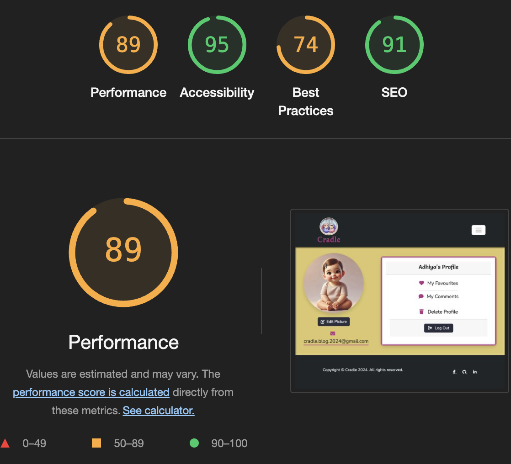

# TESTING

* [Lighthouse Testing](#lighthouse-testing)
* [Validator Testing](#validator-testing)
* [Responsiveness Testing](#responsiveness-testing)
* [C.R.U.D Testing](#crud-testing)
* [Manual Testing](#manual-testing)
* [Fixed Bugs](#fixed-bugs)
* [Unfixed bugs](#unfixed-bugs)

### Lighthouse

  

    
Sign Up

     

  

  
  

  

    
Log In

     

  

  
  

  

    
Home

     

  

  
 

   

    
About

     

  

   

  

    
Contact

     

  

  

  

    
Profile

     

  

  
 

  

    
Categories

     

  

  
   

  

    
Blog Post

     

  

  
      
 
  

    
Favourites

     

  

  
  

  
  

    
Comments

     

  

  
  

  

    
Delete Profile

     

  

  

   

    
Log Out

     

  

  

## Validator Testing

### HTML Validator [W3C](https://validator.w3.org/)

 

    
Sign Up - Pass

     

  

  

    
Log In - Pass

     

  

  
  

  

    
Email Verification - Pass

     

  

  
  

  

    
Forgot Password - Pass

     

  

  
  

  

    
Reset Email - Pass

     

  

  
  

  

    
Reset Password - Pass

     

  

  

  

    
Reset Password Done - Pass

     

  

  
       

  

    
Index HTML - Pass

     

  

  
 

   

    
About HTML - Pass

     

  

   

  

    
Contact HTML - Pass

     

  

  

  

    
Profile HTML - Pass

     

  

  
 

  

    
Categories HTML - Pass

     

  

  
   

  

    
Blog Post HTML - Pass

     

  

  
      
 
  

    
Favourites HTML - Pass

     

  

  
  

  

    
Comments HTML - Pass

     

  

  
  

  

    
Delete Profile HTML - Pass

     

  

  

   

    
404 HTML - Pass

     

  

  

   

    
500 HTML - Pass

     

  

  

  

    
Log Out HTML - Pass

     

  

  

### CSS Validator [W3C - Jigsaw CSS](https://jigsaw.w3.org/css-validator/)

CSS - Pass

 

  

### Javascript Validator [JS Hint](https://jshint.com/)

Animations JS - Pass

 

   

Comments JS - Pass

 

Favourites JS - Pass

 

Profile Pic JS - Pass

 

Scripts JS - Pass

 

### Python Validator [PEP8](https://pep8ci.herokuapp.com/)

    
About - admin.py - Pass

     

  

  

    
About - models.py - Pass

     

  

  
  

  

    
About - urls.py - Pass

     

  

  
  

  

    
Blog - admin.py - Pass

     

  

  
  

  

    
Blog - context-processor.py - Pass

     

  

  
  

  

    
Blog - forms.py - Pass

     

  

  

  

    
Blog - models.py - Pass

     

  

  
       

  

    
Blog - signals.py - Pass

     

  

  
 

   

    
Blog - urls.py - Pass

     

  

   

  

    
Blog - views.py - Pass

     

  

  

  

    
Contact - admin.py - Pass

     

  

  
 

  

    
Contact - forms.py - Pass

     

  

  
   

  

    
Contact - models.py - Pass

     

  

  
      
 
  

    
Contact - urls.py - Pass

     

  

  
  

  
  

    
Contact - views.py - Pass

     

  

  
  

  

    
Cradle - urls.py - Pass

     

  

  

## Responsiveness Testing

| **TEST**                      | **ACTION**              | **EXPECTATION**             | **RESULT** |
| ----------------------------- | ----------------------- | --------------------------- | ---------- |
| Sign Up page - responsiveness | Size site down to 320px | all elements stay on screen | ✅         |
| Sign Up page - responsiveness | Size site up to 1920px  | all elements stay on screen | ✅         |
| Email Verification Sent page - responsiveness | Size site down to 320px | all elements stay on screen | ✅         |
| Email Verification Sent page - responsiveness | Size site up to 1920px  | all elements stay on screen | ✅         |
| Login page - responsiveness    | Size site down to 320px | all elements stay on screen | ✅         |
| Login page - responsiveness    | Size site up to 1920px  | all elements stay on screen | ✅         |
| Forgot Password process (4-pages) - responsiveness | Size site down to 320px | all elements stay on screen | ✅         |
| Forgot Password process (4-pages) - responsiveness | Size site up to 1920px  | all elements stay on screen | ✅         |
| Nav Bar - responsiveness    | Size site down to 320px and the menu changes to burger icon below 768px | all elements stay on screen | ✅         |
| Nav Bar - responsiveness    | Size site up to 1920px and the burger icon changes to menu above 768px  | all elements stay on screen | ✅         |
| Home page - responsiveness    | Size site down to 320px | all elements stay on screen | ✅         |
| Home page - responsiveness    | Size site up to 1920px  | all elements stay on screen | ✅         |
| About - responsiveness    | Size site down to 320px | all elements stay on screen | ✅         |
| About - responsiveness    | Size site up to 1920px  | all elements stay on screen | ✅         |
| Contact - responsiveness    | Size site down to 320px | all elements stay on screen | ✅         |
| Contact - responsiveness    | Size site up to 1920px  | all elements stay on screen | ✅         |
| Profile page - responsiveness  | Size site down to 320px | all elements stay on screen | ✅         |
| Profile page - responsiveness  | Size site up to 1920px  | all elements stay on screen | ✅         |
| Categories page - responsiveness | Size site down to 320px | all elements stay on screen | ✅         |
| Categories page - responsiveness | Size site up to 1920px  | all elements stay on screen | ✅         |
| Blog Post page - responsiveness   | Size site down to 320px | all elements stay on screen | ✅         |
| Blog Post page - responsiveness   | Size site up to 1920px  | all elements stay on screen | ✅         |
| Favourite page - responsiveness | Size site down to 320px | all elements stay on screen | ✅         |
| Favourite page - responsiveness | Size site up to 1920px  | all elements stay on screen | ✅         |
| Comments page - responsiveness | Size site down to 320px | all elements stay on screen | ✅         |
| Comments page - responsiveness | Size site up to 1920px  | all elements stay on screen | ✅         |
| Delete Profile page - responsiveness | Size site down to 320px | all elements stay on screen | ✅         |
| Delete Profile page - responsiveness | Size site up to 1920px  | all elements stay on screen | ✅         |
| 404 page - responsiveness | Size site down to 320px | all elements stay on screen | ✅         |
| 404 page - responsiveness | Size site up to 1920px  | all elements stay on screen | ✅         |
| 500 page - responsiveness | Size site down to 320px | all elements stay on screen | ✅         |
| 500 page - responsiveness | Size site up to 1920px  | all elements stay on screen | ✅         |
| Logout page - responsiveness | Size site down to 320px | all elements stay on screen | ✅         |
| Logout page - responsiveness | Size site up to 1920px  | all elements stay on screen | ✅         |

## C.R.U.D Testing

| **TEST**          | **ACTION**             | **EXPECTATION**          | **RESULT** |
| ----------------- | ---------------------- | ------------------------ | ---------- |
| Blog Post | Create | Successfully created new posts | ✅ |
| Blog Post | Read | Posts display correctly on the Blog Post page | ✅ |
| Blog Post | Update | Post edits reflect accurately | ✅ |
| Blog Post | Delete | Posts removed successfully | ✅ |
| Profile | Create | New Instance created in database | ✅ |
| Profile | Read | Instances and data visible in Profile Page  | ✅ |
| Profile | Update | Modifications saved & visible in the Profile Page | ✅ |
| Profile | Delete | Instance removed from database with all its data and other instances that have relation with it (Comments, Favourites and Profile Picture) | ✅         |
| Comments | Create | Comment created | ✅ |
| Comments | Read | Comment visible in Blog Post page and User Profile's Comments page | ✅ |
| Comments | Update | Comment edits reflect accurately | ✅ |
| Comments | Delete | Comment removed successfully | ✅ |
| Favourites | Create | Favourite added to User Profile | ✅ |
| Favourites | Read | Favourite visible in User Profile's Favourite page | ✅ |
| Favourites | Delete | Favourite removed successfully | ✅ |
| Profile Picture | Create | Profile Picture created | ✅ |
| Profile Picture | Read | Profile Picture visible in User Profile's page | ✅ |
| Profile Picture | Update | Profile Picture update reflect accurately | ✅ |
| Profile Picture | Delete | Profile Picture removed successfully | ✅ |

Let's begin by writing manual testing for each function of your website based on the user experience flow. Below is a sample for some core functions of Cradle Blog.

---

## Manual Testing

### User Registration

| **Test**              | **Action**                                   | **Expected Outcome**                               | **Result** |
|-----------------------|----------------------------------------------|---------------------------------------------------|------------|
| Registration Form     | Click on “Signup” in the navigation bar     | Redirected to registration form                   | ✅         |
| Fill Signup Form | Enter valid user data (username, email, password) | User is successfully registered and redirected to Email Verification | ✅         |
| Invalid Email Format  | Enter invalid email format in the email field | Error message displayed indicating invalid email  | ✅ 
| Invalid Username | Enter username which is already taken | Error message displayed indicating username already taken  | ✅           |
| Password weak     | Enter weak password not meeting the required criteria      | Error message displayed indicating to meet the criteria | ✅         |
| Password Mismatch     | Enter different passwords in the password and confirm password field       | Error message displayed indicating password mismatch | ✅         |

---

### Email Verification

| **Test**                | **Action**                                      | **Expected Outcome**                                      | **Result** |
|-------------------------|-------------------------------------------------|----------------------------------------------------------|------------|
| Registration             | Register a new account                         | User receives a verification email                        | ✅         |
| Verify Email             | Click the link in the verification email        | User’s email is confirmed and they are redirected to login | ✅         |
| Invalid Link             | Try using an expired or incorrect link          | Error message displayed indicating the link is invalid    | ✅         |

---

### User Login

| **Test**              | **Action**                                   | **Expected Outcome**                               | **Result** |
|-----------------------|----------------------------------------------|---------------------------------------------------|------------|
| Login Page            | Click “Login” in the navigation bar          | Redirected to the login form                      | ✅         |
| Login with Valid Credentials | Enter valid email and password           | User is successfully logged in and redirected to homepage, confirmation message displayed | ✅         |
| Login with Invalid Credentials | Enter incorrect email or password        | Error message displayed indicating incorrect login | ✅         |

---

### Forgot Password

| **Test**                | **Action**                                      | **Expected Outcome**                                      | **Result** |
|-------------------------|-------------------------------------------------|----------------------------------------------------------|------------|
| Access Forgot Password   | Click "Forgot Password" on the login page       | Redirected to the forgot password form                    | ✅         |
| Submit Forgot Password   | Enter a registered email and submit             | User receives a password reset email and redirected to Password reset mail sent page                     | ✅         |

---

### Reset Password

| **Test**                | **Action**                                      | **Expected Outcome**                                      | **Result** |
|-------------------------|-------------------------------------------------|----------------------------------------------------------|------------|
| Reset Password Link      | Click the reset password link from the email    | User is redirected to the password reset form             | ✅         |
| Submit New Password      | Enter new password and confirm it               | Password is successfully updated, user is redirected to password reset done page | ✅         |
| Password Reset Successful      | Click "Return to Login" in password reset done page    | User is redirected to Login page | ✅         |
| Invalid Password         | Enter passwords that don’t match                | Error message displayed indicating password mismatch      | ✅         |

---

### Navigation Bar (Based on Login Status)

| **Test**                | **Action**                                      | **Expected Outcome**                                      | **Result** |
|-------------------------|-------------------------------------------------|----------------------------------------------------------|------------|
| Logged Out View          | Open site as a logged-out user                  | Navigation bar shows Logo, Home, About, Contact, Categories, Login, Signup links | ✅         |
| Logged In View           | Login as a user                                | Navigation bar shows Logo, Home, About, Contact, Categories, Profile, Logout links | ✅         |
| Login/Signup Links     | Check for Login/Register links when logged out  | Login/Signup links are visible when logged out          | ✅         |
| Profile/Logout Links     | Check for Profile/Logout links when logged in   | Profile/Logout links are visible when logged in            | ✅         |

---

### Homepage

| **Test**              | **Action**                                   | **Expected Outcome**                               | **Result** |
|-----------------------|----------------------------------------------|---------------------------------------------------|------------|
| Homepage Load         | Open the website homepage                    | All elements (navbar, blog posts, footer) load properly without delay | ✅         |
| Latest Blog Posts     | Check if latest posts appear in chronological order | Posts are displayed with title, excerpt, image and link to read the post in the correct order | ✅         |
| Navigation Links      | Click on navigation links in the header      | Users are redirected to the respective pages      | ✅         |

---

### Viewing Blog Posts

| **Test**              | **Action**                                   | **Expected Outcome**                               | **Result** |
|-----------------------|----------------------------------------------|---------------------------------------------------|------------|
| Blog Post Page        | Click on a blog post from the homepage        | Redirected to the blog post page, displayed full content with title, source link, date, image, content, navigation button, favourite icon, comment widget and comments | ✅         |
| Next/Previous Navigation | Click "Next" or "Previous" button at the bottom of the post | Redirected to the respective post chronologically | ✅         |
| Source Link | Click "Source Link" at the top below the titlet | Redirected to the respective link in a new tab | ✅         |

---

### Add or Remove Favourites

| **Test**              | **Action**                                   | **Expected Outcome**                               | **Result** |
|-----------------------|----------------------------------------------|---------------------------------------------------|------------|
| Favourite a Post      | Click on the "Favourite" button at the bottom of a blog post | Post is added to the user's favourites list, confirmation displayed | ✅         |
| Remove Favourite      | Click on the "Favourite" button again on the same post | Post is removed from the favourites list, confirmation displayed | ✅         |
| Favourite a Post without logging in     | Click on the "Favourite" button at the bottom of a blog post | Message displayed asking user to login or signup to add the post to favourites | ✅         |

---

### Post Comments

| **Test**              | **Action**                                   | **Expected Outcome**                               | **Result** |
|-----------------------|----------------------------------------------|---------------------------------------------------|------------|
| Add Comment           | Enter a comment on a blog post and submit    | Comment appears below the post with user details, confirmation displayed  | ✅         |
| Edit Comment           | Click "Edit" button below the comment    | Comment's content appears in the Leave a comment widget by scrolling to it and highlighting it in pink for few seconds, Edit button changes to Update | ✅         |
| Update Comment           | Click "Update" button in the Leave a comment widget   | Comment gets updated, confirmation displayed | ✅         |
| Cancel Update           | Click "Cancel" button in the Leave a comment widget   | Comment updates gets cancelled | ✅         |
| Delete Comment        | Click "Delete" button in the user’s comment | Confirmation modal opens asking to confirm the choice                  | ✅         |
| Delete        | Click "Delete" button in the delete comment confirmation modal | User's comment gets deleted, displayed confirmation message   | ✅         |
| Cancel Delete           | Click "Cancel" button in the delete comment confirmation modal   | Comment deletion gets cancelled | ✅         |
| Close Delete Comment Modal | Click "X" on top right of the Delete Comment Modal          | The modal gets closed  | ✅         |

---

### About Page

| **Test**                | **Action**                                      | **Expected Outcome**                                      | **Result** |
|-------------------------|-------------------------------------------------|----------------------------------------------------------|------------|
| Access About Page        | Click "About" in the navigation bar             | User is redirected to the About page, displayed blog info| ✅         |
| Content Load             | Check if the image of the site owner and blog info appear | All content on the About page loads properly              | ✅         |

---

### Contact Page

| **Test**                | **Action**                                      | **Expected Outcome**                                      | **Result** |
|-------------------------|-------------------------------------------------|----------------------------------------------------------|------------|
| Access Contact Page      | Click "Contact" in the navigation bar or footer | User is redirected to the Contact page                    | ✅         |
| Submit Inquiry           | Fill in name, email, and message fields, then submit | A confirmation message appears after form submission      | ✅         |
| Invalid Form Submission  | Submit the form with empty or invalid fields    | Error message displayed, highlighting invalid input       | ✅         |

---

### Selecting a Category and Displaying Related Results

| **Test**                | **Action**                                      | **Expected Outcome**                                      | **Result** |
|-------------------------|-------------------------------------------------|----------------------------------------------------------|------------|
| Access Categories        | Click on "Select a Category" drop-down icon in the navigation bar     | A dropdown listing all available categories appears | ✅         |
| Select Category          | Click on a specific category (e.g., "Parenting") | User is redirected to category page, displayed all posts within that category | ✅         |
| Display Category Results | Check if posts related to the selected category are displayed | Posts are correctly filtered and displayed with title, excerpt and image | ✅         |
| No Posts in Category     | Select a category with no posts                 | A message indicating "No posts available" is displayed    | ✅         |

---

### Profile Page

| **Test**              | **Action**                                   | **Expected Outcome**                               | **Result** |
|-----------------------|----------------------------------------------|---------------------------------------------------|------------|
| Profile Load          | Click on “Profile Picture” in the navigation bar      | User is redirected to their profile page, which displayed user info of Profile Picture, User Email, Username and links to My Facourites, My Comments, Delete Profile and Logout | ✅         |
| Edit Profile Picture  | Click "Edit Picture" on profile page          | Opens Edit profile picture modal  | ✅         |
| Select Profile Picture  | Click "Choose file" on Edit profile picture modal and select a picture from computer, Click "Confirm"         | Profile picture changed to chosen image, displayed confirmation message  | ✅         |
| Select Avatar  | Select an "Avatar" on Edit profile picture modal and Click "Confirm"         | Profile picture changed to chosen Avatar, displayed confirmation message  | ✅         |
| Delete Profile Picture  | Click "Delete Picture" on Edit profile picture modal          | Delete Confirmation Modal opens  | ✅         |
| Delete        | Click "Delete" button in the Delete profile picture confirmation modal | User's Profile Picture gets deleted and reverted to default profile picture, displayed confirmation message   | ✅         |
| Cancel Delete           | Click "Cancel" button in the Delete profile picture confirmation modal   | Profile picture deletion gets cancelled | ✅         |
| Close Delete profile picture confirmation modal | Click "X" on top right of the Delete profile picture confirmation modal          | The modal gets closed  | ✅         |
| Close Profile Picture Modal | Click "X" on top right of the Edit profile picture modal          | The modal gets closed  | ✅         |

### Favourites Page

| **Test**              | **Action**                                   | **Expected Outcome**                               | **Result** |
|-----------------------|----------------------------------------------|---------------------------------------------------|------------|
| My Favourites  | Click "My Favourites" on profile page          | Redirected to Favourites page which displayed all the posts favourited by the user with title, excerpt and image   | ✅         |
| Favourite Post  | Click any one of the post on Favourite page          | Redirected to the blog post page of the post clicked   | ✅         |
| No Posts in Favourites     | If a user has "No Favourite Post"                | A message indicating "Sorry, you have No Favourite Post" is displayed    | ✅         |
| Pagination in Favourites  | Scroll to the bottom if there are more than 5 posts | Pagination controls appear, allowing navigation through multiple pages | ✅         |
| Back to Profile  | Click "Back to Profile" on Favourites page          | Redirected to a Profile page   | ✅         |

### Comments Page

| **Test**              | **Action**                                   | **Expected Outcome**                               | **Result** |
|-----------------------|----------------------------------------------|---------------------------------------------------|------------|
| My Comments  | Click "My Comments" on profile page          | Redirected to Comments page which displayed all the comments made by the user   | ✅         |
| Comments  | Click any one of the comment on Comments page          | Redirected to that particular Comment in the Blog Post page, highlighting it in pink for few seconds   | ✅         |
| No Comments in Comments Page     | If a user has not made any comments                 | A message indicating "Sorry, you have No Comments" is displayed    | ✅         |
| Pagination in Comments   | Scroll to the bottom if there are more than 5 comments | Pagination controls appear, allowing navigation through multiple pages | ✅         |
| Back to Profile  | Click "Back to Profile" on Comments page          | Redirected to a Profile page   | ✅         |

### Delete Profile Page

| **Test**              | **Action**                                   | **Expected Outcome**                               | **Result** |
|-----------------------|----------------------------------------------|---------------------------------------------------|------------|
| Delete Profile | Click "Delete Profile" on Profile Page          | User is redirected to Delete Profile page  | ✅         |
| Delete | Click "Delete" on Delete Profile Page          | User profile, their favourites and comments gets deleted and logged out of the website, redirecting to home page  | ✅         |
| Cancel | Click "Cancel" on Delete Profile Page          | User is redirected to their Profile page  | ✅         |

---

### Footer (Social Media Links and Back to Top)

| **Test**                | **Action**                                      | **Expected Outcome**                                      | **Result** |
|-------------------------|-------------------------------------------------|----------------------------------------------------------|------------|
| Social Media Links       | Click on each social media icon in the footer   | Opens the respective social media site in a new tab       | ✅         |
| Back to Top Button       | Scroll down and click "Back to Top"             | Page scrolls smoothly back to the top                     | ✅         |
| Content Load      | Check if copyright message is displayed            | Copyright message is displayed in the footer

---

### Pagination of Blog Posts

| **Test**                | **Action**                                      | **Expected Outcome**                                      | **Result** |
|-------------------------|-------------------------------------------------|----------------------------------------------------------|------------|
| View Posts with Pagination | Scroll to the bottom of the blog post list when more than 5 posts are available | Pagination controls (Next, Previous) appear at the bottom of the page | ✅         |
| Navigate to Next Page   | Click "Next" on the pagination control          | User is redirected to the next page of blog posts         | ✅         |
| Navigate to Previous Page | Click "Previous" on the pagination control     | User is redirected to the previous page of blog posts     | ✅         |
| Disabled Next/Previous   | Check if "Next" or "Previous" button is disabled if on the first/last page | Appropriate button is disabled or hidden                   | ✅         |

---

### 404 Error Page (Page Not Found)

| **Test**                | **Action**                                      | **Expected Outcome**                                      | **Result** |
|-------------------------|-------------------------------------------------|----------------------------------------------------------|------------|
| Access Invalid URL       | Enter a non-existent URL (e.g., `/invalid-page`) | User is redirected to the custom 404 error page with a friendly message and link to the homepage | ✅         |
| 404 Page Navigation      | Click the link to return to the homepage        | User is redirected back to the homepage                   | ✅         |

---

### 500 Error Page (Internal Server Error)

| **Test**                | **Action**                                      | **Expected Outcome**                                      | **Result** |
|-------------------------|-------------------------------------------------|----------------------------------------------------------|------------|
| Trigger Server Error     | Simulate a server-side error (e.g., by temporarily breaking code) | User is redirected to the custom 500 error page with a message about internal server error | ✅         |
| 500 Page Navigation      | Click the link to return to the homepage        | User is redirected back to the homepage                   | ✅         |

---

### Log Out

| **Test**                | **Action**                                      | **Expected Outcome**                                      | **Result** |
|-------------------------|-------------------------------------------------|----------------------------------------------------------|------------|
| Access Log Out           | Click "Logout" in the navigation bar or profile page           | User is redirected to the logout confirmation page        | ✅         |
| Confirm Logout           | Click "Logout" button on confirmation page      | User is logged out and redirected to the homepage         | ✅         |
| Cancel Logout            | Click "Cancel" on the logout confirmation page  | User is redirected back to home without logging out | ✅         |

## Bugs

### Fixed Bugs

During development, several bugs were encountered and resolved:

## Fixed Bugs

### Categories Dropdown Flickering

- **Issue**: The categories dropdown list was flickering when users hovered over it. This issue was caused by an overlapping background animation, leading to a poor user experience.

- **Fix**: To resolve the issue, I replaced the bootstrap dropdown list with the Choices.js plugin, which provides a more stable and user-friendly dropdown interface. The plugin eliminated the flickering and improved the performance and visual consistency of the categories dropdown.

### Database Migration Issue

- **Issue**: Database migrations failed due to a conflict in the field types.
- **Fix**: Corrected field types in `models.py` and re-ran migrations, which resolved the conflicts and allowed migrations to complete successfully.

### Profile Picture Upload

- **Issue**: Uploaded profile pictures which were not square were displaying in ovals and not circle.
- **Fix**: Adjusted Cloudinary image upload settings to make sure image dimension is square in the image link which ensured the images uploaded with different dimension remains circle.

### Post Pagination

- **Issue**: Pagination buttons were incorrectly displayed when there were fewer than 5 posts.
- **Fix**: Added conditional rendering logic to only display pagination controls when necessary.

### Form Validation

- **Issue**: Form validation errors were not displaying inline as expected.
- **Fix**: Corrected the validation logic to ensure errors are displayed inline, enhancing the user experience.

### CSS Alignment

- **Issue**: Elements on the Comment box in post-detail page were misaligned on specific screen sizes.
- **Fix**: Adjusted CSS to ensure proper element alignment across all devices.

### JavaScript Functions Not Working in `scripts.js`

- **Issue**: JavaScript functions were not functioning correctly when all scripts were written together in the `scripts.js` file. This caused conflicts and performance issues across different features.

- **Fix**: To resolve the issue, the functions were separated into individual JavaScript files, each dedicated to a specific feature. By modularizing the code into separate files, the bugs were fixed, and the functionality of each feature was restored, ensuring smooth performance across the site.

### CSRF Token Failure on Mobile Login

**Issue**: While attempting to log in via a mobile device, users encountered a "CSRF token failed" error. This was due to the deployed link not being included in the CSRF trusted origins list.

**Fix**: The fix was to add the actual deployed site URL in the `CSRF_TRUSTED_ORIGINS` setting instead of the Heroku link, which resolved the issue and allowed successful logins from mobile devices.

---

## Unfixed Bugs

- There is no unfixed bugs.